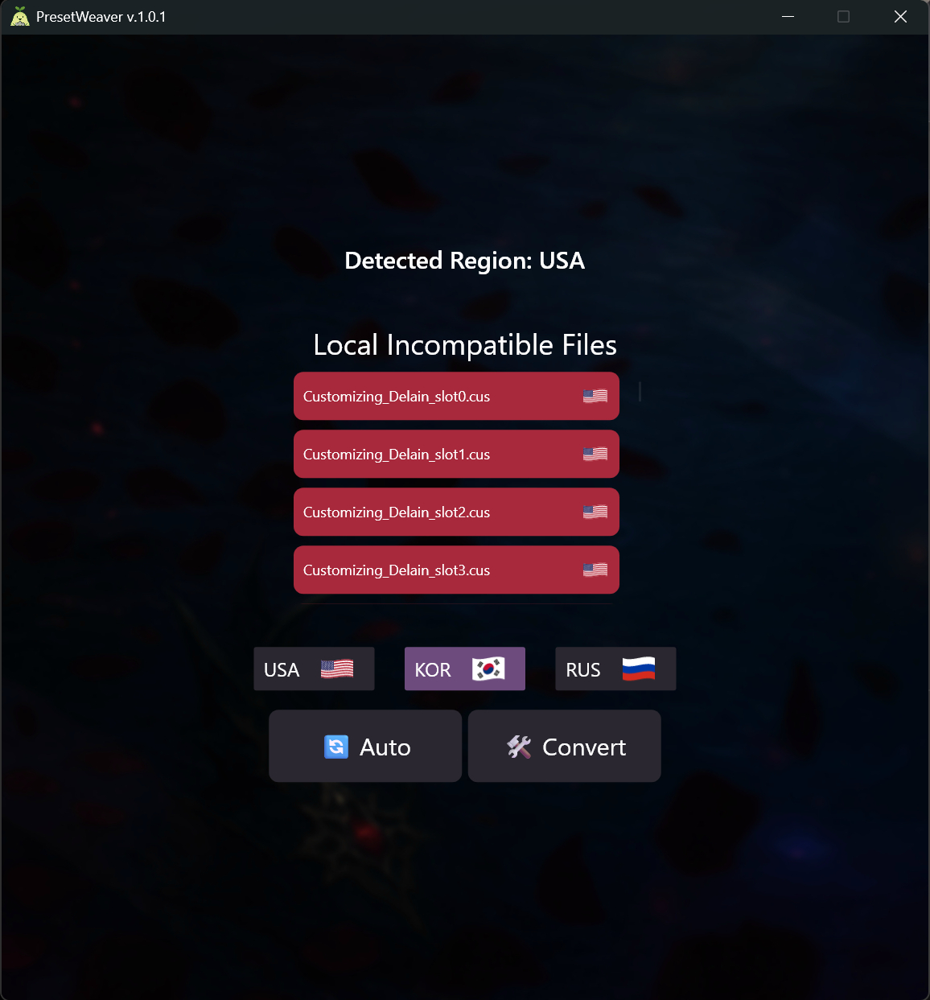

<table>
<tr>
<td width="40%">

</td>
<td width="60%">
<h2>An unofficial Lost Ark preset converter — automatic or manual!</h2>

<strong>Download the <code>.zip</code> under <a href="https://github.com/Smotto/PresetWeaver/releases">Releases</a> 👉</strong>

### ✨ Features

- 🔍 <strong>Auto-detects</strong> your Lost Ark Customizing folder
- 🌍 <strong>Detects your local region</strong> (no internet required)
- 📄 Shows which files are <strong>not yet converted</strong> to your selected region
- 🎨 Includes beautiful aesthetic artwork
- ⚡ Lightweight: <strong>< 1MB executable</strong>
</td>
</tr>
</table>

## 🛠 How to Use

### 🧑‍💻 Manual Mode

1. Select your preferred region
2. Click **Convert**

### ⚙️ Automatic Mode

1. Select your preferred region
2. Click **Auto**
   → Any new or modified files will be auto-converted to the selected region

---

## 🚧 Beta Notice

This tool is still in **beta** and under active development.

**Planned Feature:**
📁 Export customizations to a folder of your choice

---

## 🌐 Preset Sharing
**Preset Channels:**

* KOR: [KOR Presets](https://discord.com/channels/943866124292980796/944238985121787964)
* USA: [USA Presets](https://discord.com/channels/212635560596996097/943796313257037824)
* RUS: [RUS Presets](https://discord.com/channels/567277753607651338/1207978460568485899)

---
